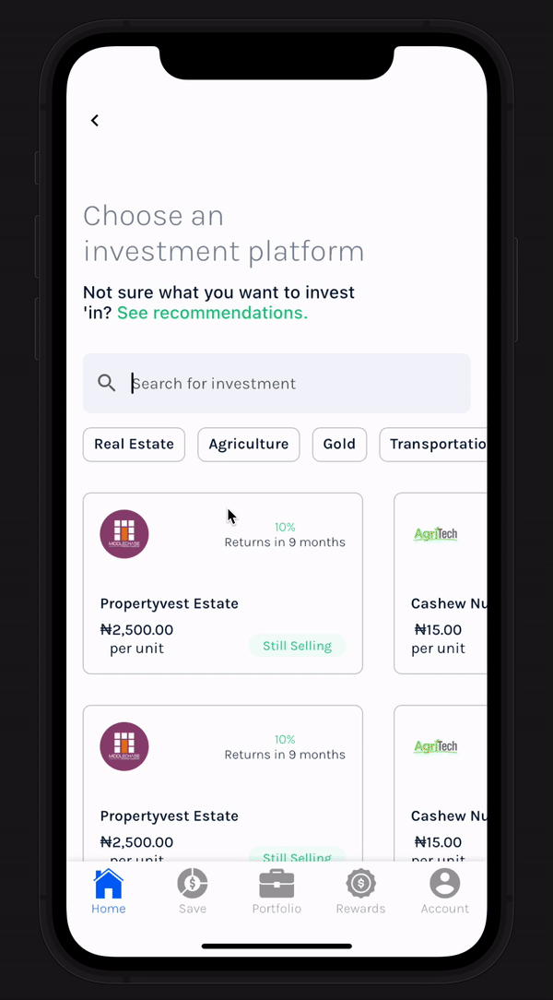

# Investment  App Design

## Project Overview
This is a mobile application designed to showcase a dynamic investment filtering system with an intuitive user interface.

## Features
- Horizontal scrollable filter buttons
- Dynamic investment list filtering
- Single-select filter mechanism
- Responsive UI design

## UI Components

### Filter Buttons
- Horizontal scrollable list of investment categories
- Interactive selection with visual feedback
- Categories include:
    - Real Estate
    - Agriculture
    - Gold
    - Transportation

### Investment List
- Horizontal scrollable list of investment cards
- Dynamically updates based on selected filter
- Supports multiple rows of investment cards

## Technical Implementation

### Key Technologies
- Flutter
- Stateful Widget
- Provider for state management

### Filtering Mechanism
- Supports single filter selection
- Toggle filter on/off
- Immediate list update on filter change

## Design Specifications
- Filter Button Styling:
    - Default: Light background with grey border
    - Selected: Dark blue background with white text
- Consistent padding and spacing
- Responsive design for various screen sizes

## Installation
1. Clone the repository
2. Ensure Flutter SDK is installed
3. Run `flutter pub get`
4. Connect a device or start an emulator
5. Run `flutter run`

## Demo

